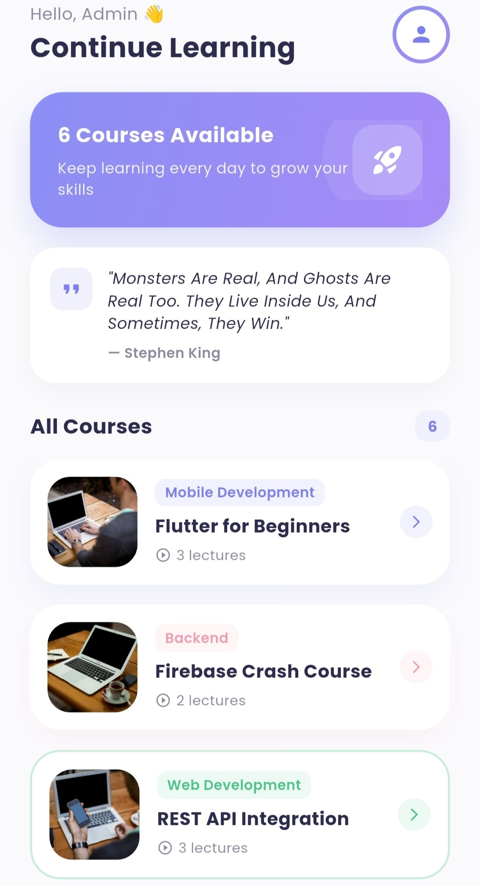

<div align="center">

# 📚 Internee LMS Learning App

A mobile Learning Management System app built with Flutter, Firebase, and REST APIs developed as part of the **Internee.pk Mobile App Development Internship**.

</div>

---

## 📖 Overview

**Internee LMS** gives students and interns easy access to course content on the go. Users can browse courses, watch video lectures, attempt quizzes with real-time scoring, and track their learning progress — all wrapped in a clean, modern interface.

## 📸 Screenshots

| Login | Home | Course Detail |
|:---:|:---:|:---:|
|  |  |  |

| Video Player | Quiz | Profile |
|:---:|:---:|:---:|
|  |  |  |

> *(See [Adding Your Screenshots](#-adding-your-own-screenshots) below for how to fill these in.)*

## ✨ Features

- 🔐 **Firebase Authentication** - secure email/password login & signup
- 📖 **Course Catalog** - browse courses by category with lecture counts
- 🎥 **Integrated Video Player** - watch lectures with full playback controls (play, pause, seek, fullscreen)
- ✅ **Interactive Quizzes** - real-time scoring with instant visual feedback (correct/incorrect highlighting)
- 📊 **Progress Tracking** - quiz scores and completion history saved to Firestore per user
- 🌐 **REST API Integration** - daily motivational quote fetched live from a public REST API
- 🎨 **Modern UI** - soft gradients, smooth animations, and a polished, professional design
- 🚪 **Secure Logout** - with confirmation dialog

## 🛠️ Tech Stack

| Layer | Technology |
|---|---|
| Framework | Flutter (Dart) |
| Authentication | Firebase Authentication |
| Database | Cloud Firestore |
| REST API | [dummyjson.com](https://dummyjson.com) (Quote of the Day) |
| Video Playback | `video_player` + `chewie` |
| Typography | Google Fonts (Poppins) |
| State Management | Native `StatefulWidget` / `setState` |

## 🗂️ App Flow

```
Splash Screen
     ↓
Login  ──────→  Signup
     ↓
Home (Course Listing)
     ↓
Course Detail  ──────→  Video Player
     ↓
   Quiz  ──────→  Quiz Result
     ↓
  Profile (Progress + Logout)
```

## 📁 Project Structure

```
lib/
├── main.dart                      # App entry point + theme + Firebase init
├── data/
│   └── dummy_data.dart            # Course catalog & quiz question bank
├── services/
│   ├── auth_service.dart          # Firebase Authentication logic
│   ├── firestore_service.dart     # Quiz progress read/write (Firestore)
│   └── quote_service.dart         # REST API call for daily quote
└── screens/
    ├── splash_screen.dart
    ├── login_screen.dart
    ├── signup_screen.dart
    ├── home_screen.dart
    ├── course_detail_screen.dart
    ├── video_player_screen.dart
    ├── quiz_screen.dart
    ├── quiz_result_screen.dart
    └── profile_screen.dart
```

## 🚀 Getting Started

### Prerequisites
- [Flutter SDK](https://docs.flutter.dev/get-started/install) installed
- A [Firebase](https://console.firebase.google.com) project

### 1. Clone the repository
```bash
git clone https://github.com/YOUR-USERNAME/internee-lms-app.git
cd internee-lms-app
```

### 2. Install dependencies
```bash
flutter pub get
```

### 3. Configure Firebase
1. Create a project at [console.firebase.google.com](https://console.firebase.google.com)
2. Add an Android app to the project (use your own package name, or `com.example.internee_lms_app`)
3. Download `google-services.json` and place it in `android/app/`
4. In the Firebase Console, enable:
   - **Authentication → Sign-in method → Email/Password**
   - **Firestore Database** (start in test mode)

### 4. Run the app
```bash
flutter run
```

## 🔑 Key Implementation Details

- **Authentication**: `AuthService` wraps `firebase_auth` calls (`signUp`, `login`, `logout`) and returns human-readable error messages for common failures (weak password, email already in use, etc.).
- **Progress Tracking**: Each completed quiz is written to `progress/{userId}/quizzes/{autoId}` in Firestore, storing score, total, and a server timestamp. The Profile screen aggregates this data to show quizzes completed and average score.
- **REST API**: `QuoteService` performs a `GET` request to a public REST endpoint and parses the JSON response, with a graceful fallback if the request fails.
- **Null Safety**: All Firestore/dummy-data reads use null-aware operators (`??`) so a missing field never crashes the UI.

## 👨‍💻 Developer

**UsmanShahid**
Mobile App Developer (Flutter) - Internee.pk Internship Program
📍 Islamabad, Pakistan

---

<div align="center">
Built with 💙 using Flutter & Firebase
</div>